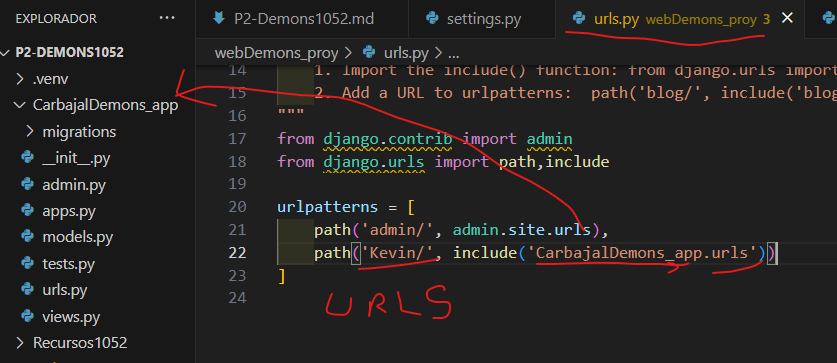

- Crear aplicacion CarbajalDemons_app
- Comando --> python manage.py startapp CarbajalDemons_app
- Creamos el archivo urls.py en CarbajalDemons_app
- 
- En setting.py de webDemons_proy
- 
- En urls.py de P2Demons1052
- 
- En urls.py en CarbajalDemons_app
- 
- En views.py en CarbajalDemons_app
- 
- EN urls.py en CarbajalDemons_app
- 
